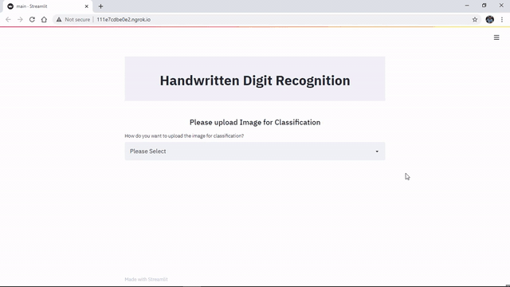
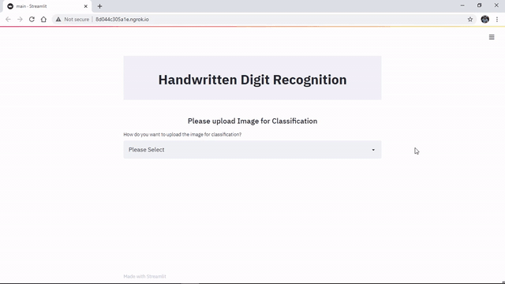
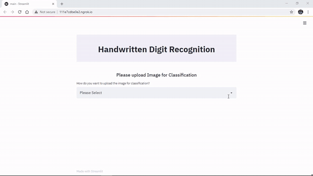

# Handwritten Digit Recognition

Here's a web-based application built to allow an user to upload an image of a handwritten digit or draw them in the app itself and get a prediction by the model as to what he/she has entered. The MNIST dataset from sklearn has been to train the neural network model having an input layer, two hidden layers and an output layer with ten units, for 10 digits (0-9).  

# Steps for using the Web App
- Setting up the Python Environment with the dependencies:

        pip install -r Requirements.txt

- Cloning the Repository: 

        git clone https://github.com/srijarkoroy/HandwrittenDigitRecognitionWebApp.git
- Entering The directory: 

        cd HandwrittenDigitRecognitionWebApp
- Running the Web App:

        streamlit run app.py
- Stopping the web app from the terminal:

        Ctrl+C
        
# Demonstration
 

Here's a Demo as to how the Web App may be used effectively:
 

## Uploading Image from Device

 

## Uploading Image via Link

 

## Drawing the Image within the Web App

